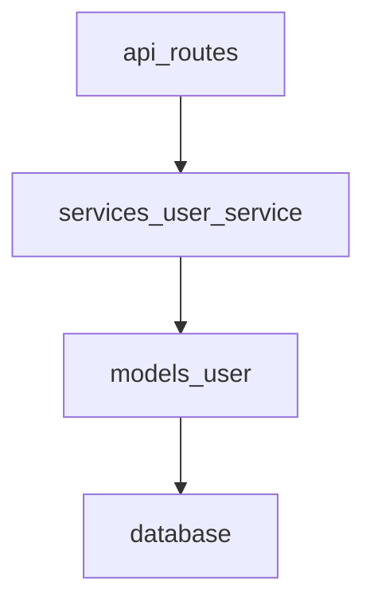
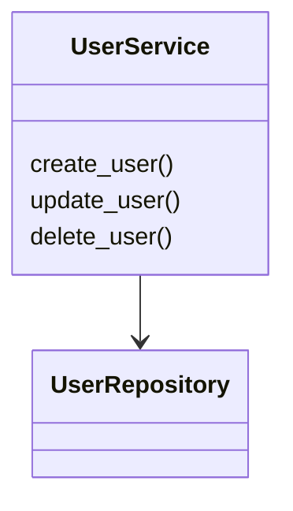
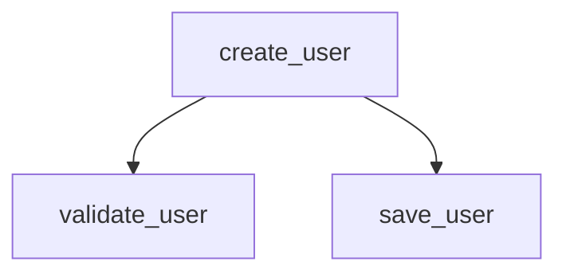

# Scout — Codebase Exploration Skill

Scout gives you four deterministic CLI tools that return structured JSON.
Your job as the agent is to run the tools, interpret the output, and
produce human-readable summaries, Mermaid diagrams, and documentation.

## Tools

All tools live in the `tools/` directory relative to this skill.
Run them with `python <tool_path> [args]`.

### scan_repo.py

Discover every Python file under a directory.

```bash
python tools/scan_repo.py --path . --max-preview-lines 50
```

Returns `{ files: [{ path, type, preview }] }`.

### analyze_python_file.py

AST-based analysis of a single Python file.

```bash
python tools/analyze_python_file.py <filepath>
```

Returns `{ classes, functions, imports, calls }`.

### build_dependency_graph.py

Import-based dependency edges across the repo.

```bash
python tools/build_dependency_graph.py --path .
```

Returns `{ edges: [{ from, to }], external_dependencies }`.

### detect_hotspots.py

Identify high-complexity modules via LOC, function count, imports, fan-in, fan-out.

```bash
python tools/detect_hotspots.py --path . --loc-threshold 500
```

Returns `{ hotspots: [{ file, loc, imports, fan_in, fan_out, reasons }] }`.

---

## Agent Workflow

Follow these steps in order:

### Step 1 — Scan the repository

```bash
python tools/scan_repo.py --path <root>
```

Review the output and generate a **one-line summary** for each file
based on the preview text.

### Step 2 — Build the dependency graph

```bash
python tools/build_dependency_graph.py --path <root>
```

From the edges, generate a **Mermaid architecture diagram**:

````markdown

````

Sanitize node IDs (replace `/`, `.` with `_`).

### Step 3 — Detect hotspots

```bash
python tools/detect_hotspots.py --path <root>
```

Present a table of hotspot files with their metrics and reasons.

### Step 4 — Ask the user which file to analyze

Offer the user a list of interesting files (e.g. hotspots or key modules).
Wait for their selection.

### Step 5 — Analyze the selected file

```bash
python tools/analyze_python_file.py <filepath>
```

From the output, generate:

**Class diagram:**

````markdown

````

**Call graph:**

````markdown

````

### Step 6 — Generate ARCHITECTURE.md

Compile all findings into an `ARCHITECTURE.md` file with these sections:

1. **Architecture Overview** — one-paragraph summary
2. **Repository Structure** — file summaries table
3. **System Architecture** — Mermaid dependency diagram
4. **Key Modules** — descriptions of important modules
5. **Hotspots** — table of flagged files
6. **Diagrams** — class and call-graph diagrams from Step 5

Use the template in [architecture-template.md](architecture-template.md).

---

## Mermaid Conventions

- Use `graph TD` for architecture/dependency diagrams.
- Use `classDiagram` for class diagrams.
- Use `flowchart TD` for call graphs.
- Sanitize identifiers: replace non-alphanumeric chars with `_`.
- Keep diagrams under ~30 nodes; group by package if larger.

---

## Principles

- Tools are deterministic and return JSON; interpretation is your job.
- Summarize previews using your language understanding — do not echo raw code.
- Always present findings before generating `ARCHITECTURE.md`.
- Ask the user before overwriting an existing `ARCHITECTURE.md`.
