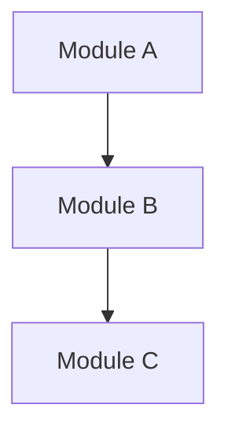
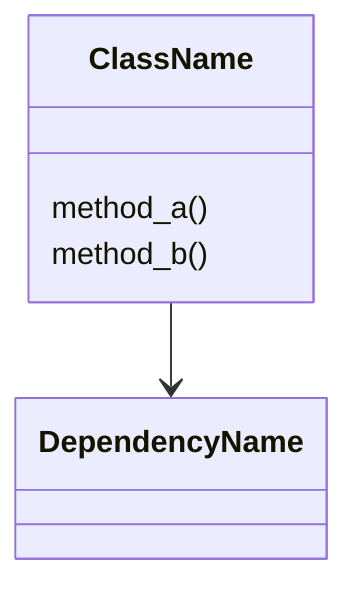
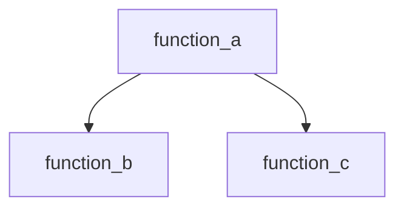

# Architecture Overview

> One-paragraph summary of the repository's purpose, technology stack, and
> high-level design.

## Repository Structure

| File | Summary |
|------|---------|
| `path/to/file.py` | One-line description |

## System Architecture

## Key Modules

### module_name

Purpose, responsibilities, and key classes/functions.

## Hotspots

| File | LOC | Functions | Imports | Fan-in | Fan-out | Reason |
|------|-----|-----------|---------|--------|---------|--------|
| `path/to/file.py` | 1200 | 25 | 18 | 7 | 10 | high complexity |

## Diagrams

### Class Diagram

### Call Graph

