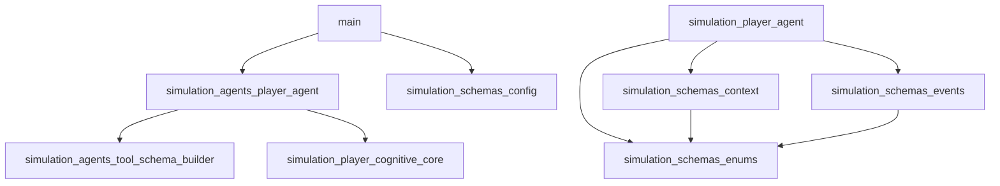
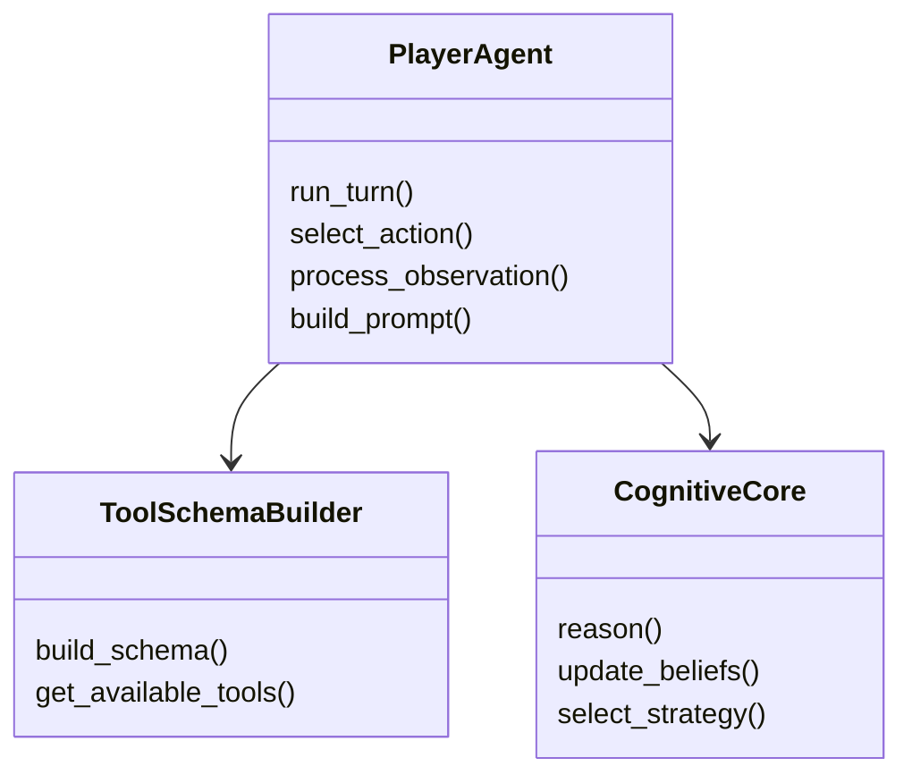
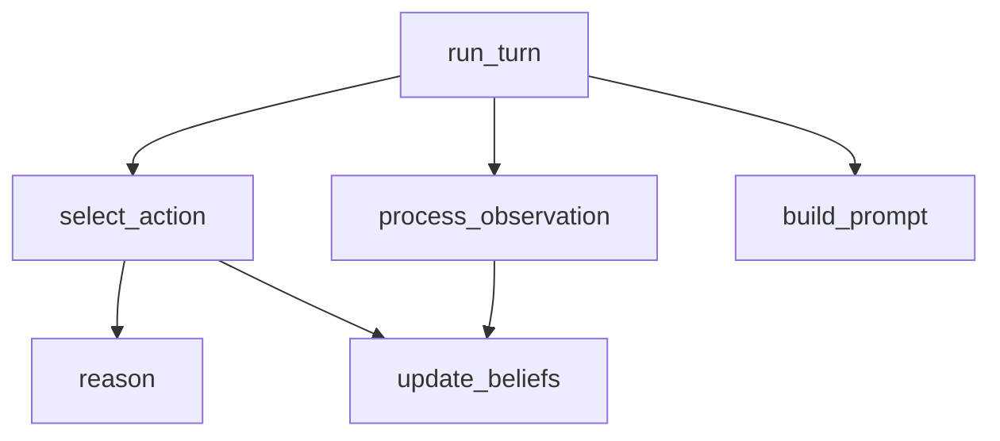

# Architecture Overview

This repository implements a **Werewolf social deduction game simulation**
powered by LLM agents. The system orchestrates multi-agent games where AI
players interact through structured communication protocols, with a game
master managing rounds, voting, and role-based actions.

## Repository Structure

| File | Summary |
|------|---------|
| `main.py` | CLI entry-point — launches a simulation run |
| `src/simulation/agents/player_agent.py` | Core agent that wraps LLM calls with game-specific tooling |
| `src/simulation/agents/tool_schema_builder.py` | Dynamically constructs tool schemas for agent actions |
| `src/simulation/player/agent.py` | Player agent implementation with cognitive processing |
| `src/simulation/player/cognitive_core.py` | Internal reasoning engine for player decision-making |
| `src/simulation/schemas/config.py` | Pydantic configuration models |
| `src/simulation/schemas/context.py` | Game context and state tracking schemas |
| `src/simulation/schemas/enums.py` | Role, phase, and action enumerations |
| `src/simulation/schemas/events.py` | Event model definitions for game actions |

## System Architecture

## Key Modules

### simulation/agents/player_agent.py

Central agent module that connects LLM inference with game actions.
Manages tool-calling, memory, and strategic decision-making.

### simulation/player/cognitive_core.py

Implements the reasoning pipeline: observation → belief update →
strategy selection → action output. Separates "thinking" from "acting".

### simulation/schemas/

Pydantic models defining the shared data contract across the system:
configurations, game context, events, and enumerations.

## Hotspots

| File | LOC | Functions | Imports | Fan-in | Fan-out | Reason |
|------|-----|-----------|---------|--------|---------|--------|
| `src/simulation/agents/player_agent.py` | 620 | 22 | 16 | 5 | 9 | high LOC, many functions, many imports |
| `src/simulation/player/cognitive_core.py` | 480 | 18 | 14 | 3 | 7 | many functions, many imports |

## Diagrams

### Class Diagram — player_agent.py

### Call Graph — player_agent.py

